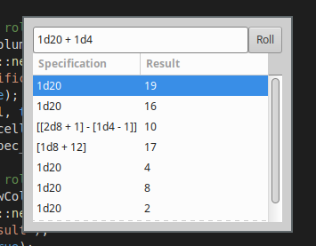

# d20roll

A dice roller application written in Rust, supporting "d20 system" notation. Download it [here](https://github.com/leotindall/d20roll/releases/).

## Operation

`NdM` rolls N dice with M sides. Integer arithmetic is supported (using D&D rounding); `1d20 + 2` will roll a single 20 sided die and add 2. Parentheses are supported for grouping, so `(2d20 + 4) / 2 - (1d4 * 2)` will resolve as expected.

## Compiling

Simply download and run `cargo build --release`. Your binary will be available at `./target/release/d20roll`.

You may need GTK+3 libraries for your system to do this; please refer to [this page](http://gtk-rs.org/docs/requirements.html). For Ubuntu, the appropriate package is `libgtk-3-dev`.
